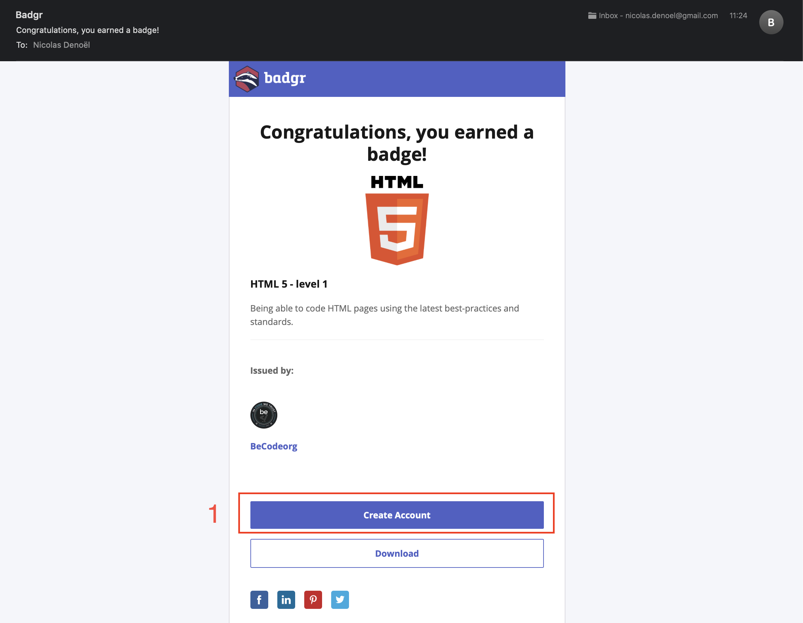
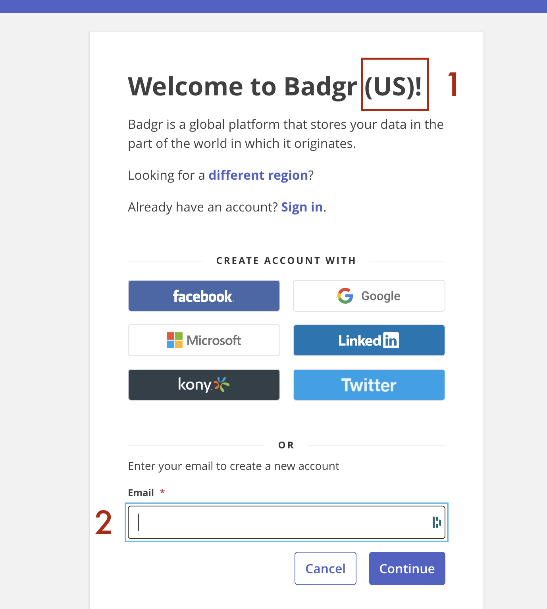
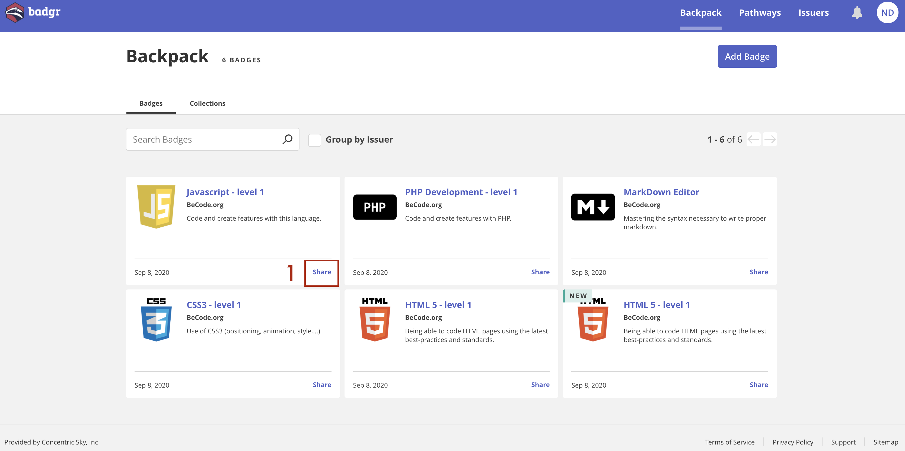
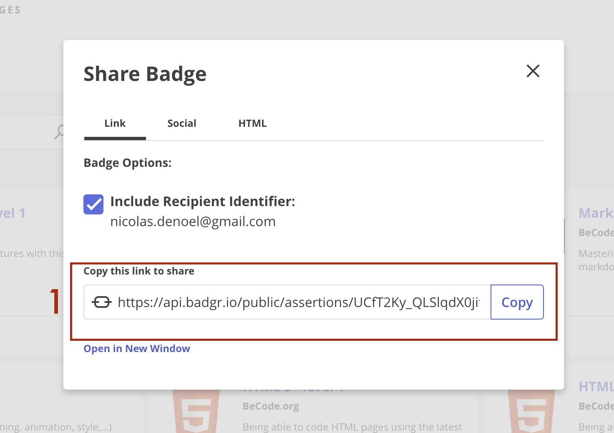
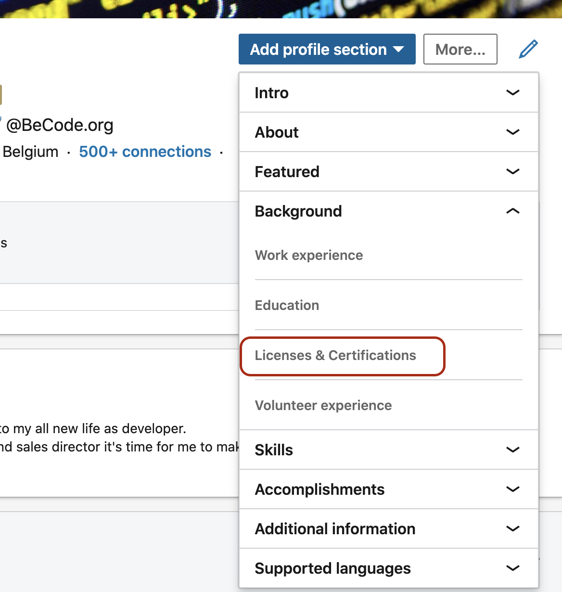
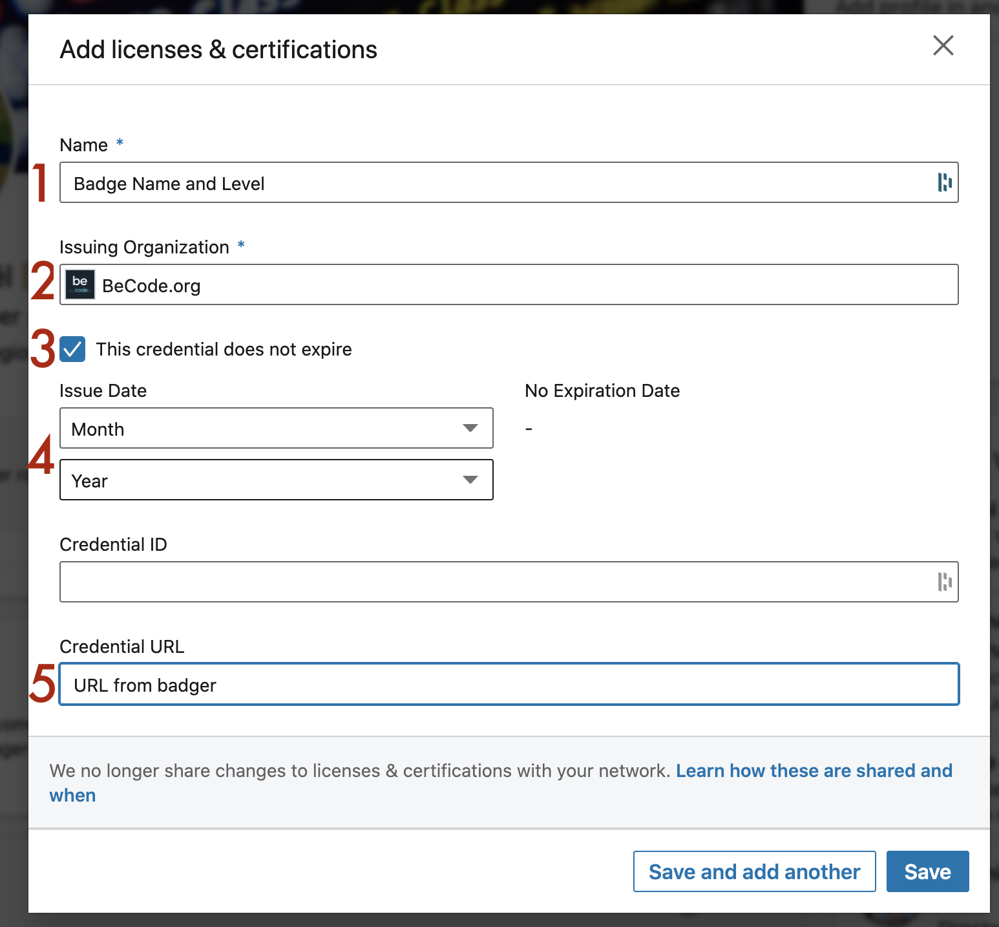
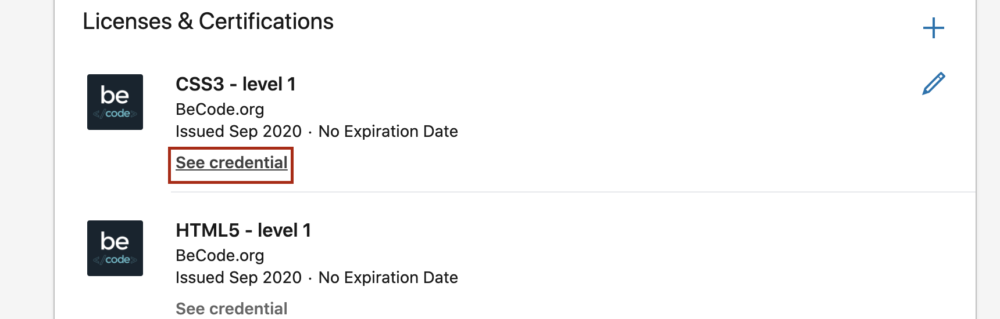
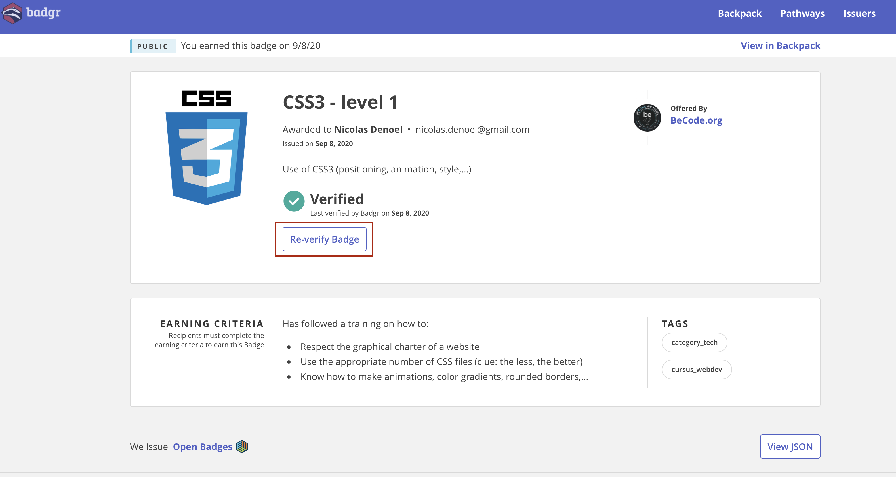
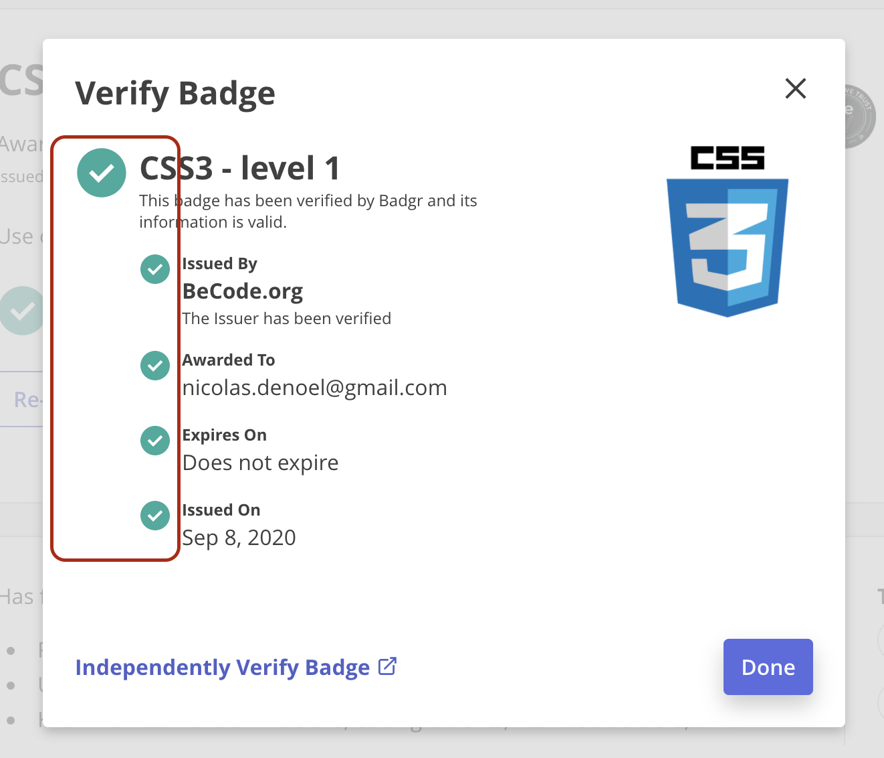

# BADGR - LINKEDIN :trophy:
> Grab your badges and show them proudly in LinkedIn

##  Index

-   [Badgr account](#badgr-account)
-   [Share link](#share-link)
-   [LinkedIn](#linkedin)
-   [Badge view](#badge-view)

--- 

## Badgr account
>   Step to create your BADGR's account

*   In the mail you've just received with your badge inside, coming from your Becode's coach, click **Create Account**

*   **1** When you're redirected, be sure to join **badgr US**
*   **2** Be sure to use the same email as in your Becode account

---

## Share link
>   Step to get your badge link

*   Through the **Backpack**, choose wich badge you want to add to LinkedIn and then click on **Share** button

*   In the pop-up window, click **Copy** side of the URL

--- 

## LinkedIn

*   Go to your profile page, then click on the **Add profile section**
*   In the dropdown menu, select **Licenses & Certifications** in the **Background** section

1.  Enter the badge name and level, like you can see it on Badgr
2.  Choose **Becode.org**, the search engine should suggest it to you
3.  Becode's badges doesn't require a renewal, so check the box *This credential does not expire*
4.  Enter month and date of badge validation
5.  Copy the URL you pasted in Badgr

*   After saving, you should see your new badge in your LinkedIn profile, in the section **Licenses & Certifications**
*   When someone click on **See credential** it should open a link to **Badgr**

*   When you reach Badgr through the public link you see all details
*   You can click on **Re-verify badge** to check his validity live

*   Here you see that all required bulletpoints are validated, so your badge is active

