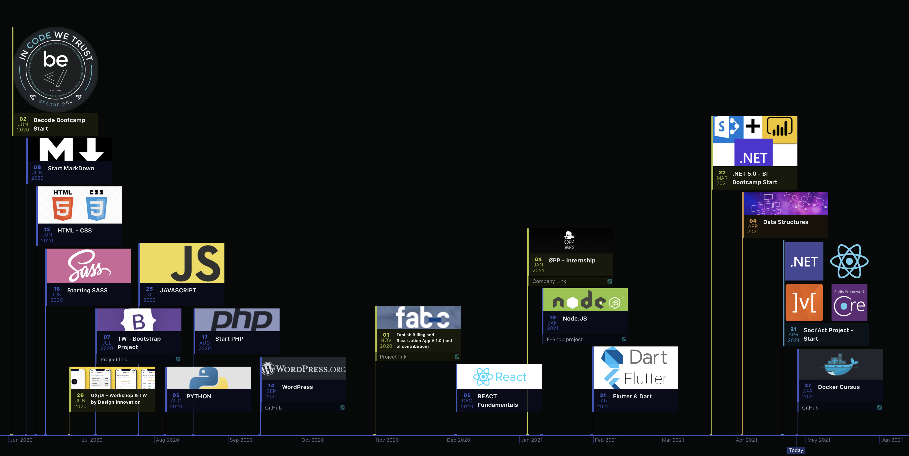

<!-- PROJECT LOGO -->
<br />
<p align="center">
  <a href="https://github.com/nicode-io/DockerCursus">
    
  </a>

<h3 align="center">DOCKER CURSUS</h3>

<p align="center">
    Discover the super powers of containers
    </br>
</p>
<p align="center">
    <br />
    <br />
    <a href="#description">Description</a>
    ·
    <a href="#cheatsheet">Main Commands</a>
    ·
    <a href="#tips">Tips</a>
    ·
    <a href="#timeline">Timeline</a>
</p>

---

## Description

<p>
This non-exhaustive documentation aims to introduce the concepts and use of containerisation with Docker through the different commands.
</p>
<p>
Docker has become a must-have because of its ease of use and its possibilities to isolate an environment. Far from being exhaustive this repo aims to make the understanding of the tool accessible to beginners.
</p>
<p>
Being regularly confronted with questions related to the deployment of my various projects, it seemed obvious to me to turn to Docker in order to be able to gather my projects on the same VPS while managing to deploy various solutions going from Node applications to .Net applications among other examples
</p>
<br/>

---

## Cheatsheet

### Global

* ```docker version``` Check version and docker installation
* ```docker info``` Display config values of engine
* ```docker login``` Add login credentials to log on Docker Hub
    + ```cat .docker/config.json``` To see your credentials
* ```docker logout``` Remove login credentials to log off Docker Hub
    + Log off every time if you don't trust the computer you're working on
* ```docker help``` Get all commands you can use
* ```docker system prune``` Purge Docker of all dangling images, containers, volumes and networks
    + -a => Also removes unused files (not just dangling, so not associated with a container)

### Images

> Images are made up of file system changes and metadata

+   #### Build, Delete
    * ```docker image build -t imageName .``` Build an image from Dockerfile in current folder
        + -t => Define a name, and eventually a tage for built image
        + . => In current folder, otherwise use a path to Dokcerfile
    * ```docker rmi -f containerId``` Force deleting image according to its id
        + Also works with first numbers of image id and multiple id
+   #### List, Logs, Process
    * ```docker image ls``` See all images on your system
    * ```docker image inspect imageName``` Display image metadata
    * ```docker image history imageName``` Show layers update in an image
+   #### Tags, Publish
    * ```docker image tag originalImageName accountName/newImageName``` Create a new image and tag from an existing
      image
        + Here tag is not specified and so will be **latest** by default
    * ```docker image tag accoutnName/imageName accountName/imageName:customTag``` Add a custom tag to an existing image
    * ```docker image push accountName/imageName``` Push an image to DockerHub repository
    * ```docker image push accountName/imageName:customTag``` Push an image to DockerHub with custom tag
        + As usual with Docker, if layers are similar it won't create a new image but associate the existing one with
          the new tag

### Container

> A container is just a single read/write layer on to of image

+   #### Run Stop Delete
    * ```docker container run --publish 8080:80 --detach --name webhost nginx``` run a container
        + old: docker run
        + --publish systemPort:containerPort => Choose which port to open for container
        + --detach => Use container in detached window
        + --env => Add environment variables, -e also works
        + --name => Set the name of the container
        + --link => Specify the virtual network to connect
        + --rm => automatically remove container when exist (execute something and destroy)
        + imageName
    * ```docker stop container containerId``` Stop running a container
        + Old: docker stop
        + Also works with first numbers of container id and multiple id
    * ```docker container rm -f 133 24e 3f3``` Delete multiple containers
        + Numbers are first number of container id
        + -f => Forces delete of running containers


+   #### List, Logs, Process
    * ```docker container ls``` List all running containers
        + old: docker ps
    * ```docker container ls -a``` List all containers installed
    * ```docker containers logs containerName``` Return log history of container
    * ```docker container top containerName``` See running processes in container
    * ```docker inspect containerName``` Display container metadata
    * ```docker stats``` Streaming stats about all running containers
        + ```docker stats containerName``` Streaming stats for specific container

+   #### Work into a container
    +   #### Create and first-time running a container with interactive terminal
        * ```docker run -it --name proxy nginx bash```
            + -i => Keep session open to receive terminal input (interactive)
            + -t => Simulate a terminal (like SSH)
            + bash => The kind of terminal used
            + (nginx) => ContainerImage, nginx is an example

    +   #### Re-run a container with interactive terminal
        * ```docker start -ai ubuntu```
            + -a => attached
            + -i => interactive

    +   #### Run a shell in a running container
        * ```docker container exec -it mysql bash```
            + Give you root shell access into (mysql for example) container

### Network

*   #### Get network information
    + ```docker container port containerName``` See ports used in container
    + ```docker network inspect networkName``` Display info about virtual network
        + --format '{{ .NetworkSettings.IPAddress }}' Allows you to get a clean result of your search while using **
          inspect** command (IPAddress is an example)
    + ```docker network ls``` List all Docker virtual networks
    + ```docker network inspect containerId``` Display information about virtual network
        + Also works with first numbers of network id and multiple id
*   #### Create, (dis)connect and delete network
    + ```docker network create --driver``` Create a virtual network
        + --driver => specify a driver, default is **bridge** (see tips for details)
    + ```docker network connect networkId containerId``` Connect a container to a virtual network
    + ```docker network disconnect networkId containerId``` Disconnect a container from a virtual network
    + ```docker network rm networkId``` Remove virtual network
        + Also works with first numbers of network id and multiple id
*   #### Communicate within network
    + ```docker container exec -it containerOne ping containerTwo``` Check communication between two containers that are
      in the same virtual network
*   #### DNS
    + ```docker container run -d --net networkName --net-alias netScopeAlias imageName``` Create a container with a
      custom network and alias
        + --net => specify virtual network name
        + --net-alias => specify an alias in the network-scope for the container

<br/>

---

## Tips

+   ### Global
    *   #### Get into local docker VM (windows-MacOS)
        +   As Docker runs into a mini VM on Windows and Mac you won't see container's processes running with
          command ```ps aux```
        +   To see running processes:
            *   Run ```docker run -it --rm --privileged --pid=host justincormack/nsenter1```
            *   Type ````ps aux```` to look for all processes
            *   Type ```ps aux | grep processName``` to look for a specific process name
    *   #### What is Alpine
        +   Alpine is a minimalist Linux distribution, ideal for containers so.
        +   Image size of Alpine is only more than 5Mb (where Ubuntu for example is more than 70Mb)
        +   Alpine don't have bash installed, but you can use ```sh``` it's the terminal of this distribution
        +   **APK** is the package manager for Alpine
            *   Quit with ```exit```
+   ### Image
    *   #### What is (not) an image
        +   App binaries and dependencies
        +   Metadata about the image and running information
        +   It's not, like a virtual machine, a complete OS.
        +   Image use host kernel
        +   Very flexible: from one file to a full Linux distribution with LAMP stack for example
        +   Docker never duplicate image if an exact match is existing on host
        +   Each layer of an image as its own SHA and is only stored once on host (space-saving)
        +   Image is read-only and can be accessed multiple times by multiple containers
    *   #### Building, Dockerfile
        +   When Docker build an image, it attributes a SHA to each layer, later if this layer hasn't changed Docker will
          reuse it. That's what's make Docker so fast and powerful
    
+   ### Container
    *   #### Operations inside a container
        +   Once you used ```docker run -it --name proxy nginx bash``` you have access to terminal, you can then make
          operations like in a classic terminal like ```ls -al``` or ```apt install``` on a Linux-based container.
        +   It's important to understand that operations in your container persist inside the container but will never
          change the original image that you used to create the container
        +   If ```ps -aux``` is not available in container (like now in mysql)
          run ```apt update && apt install -y procps```


*   ### Network
    +   #### Default virtual networks
        +   **bridge** or **docker0** is the default network that bridges NAT firewall to Host
        +   **host** network links container directly to host without using Docker VM, it passed out security of
          containerisation but can sometimes improve performance, be aware while using it
        +   **none** is not link virtual network
    +   #### Networks good practise
        +   Each virtual network routes through NAT firewall on host IP
        +   All containers on a virtual network can talk to each other without -p
        +   Best practice is to create a new virtual network for each app
        +   Create your apps so frontend / backend sit on same Docker network
        +   Inter-communication never leaves host
        +   All externally exposed ports closed by default
        +   You must expose via -p, which is better default security
    +   #### Docker DNS
        +   Use containerName for communication within the same network
        +   Don't rely on IP's because they could change at any moment
        +   Use custom network, default network like bridge don't have the containerName DNS logic

<br/>

---

<a href="https://linkedin.com/in/nicolas-denoel">
  
</a>  <a href="https://twitter.com/nicode_io">
  
</a>  

## Timeline

> Current steps and history of my reconversion

<a href="https://timelines.gitkraken.com/timeline/2e12cc334eb0406b84bf7a6339e666c4?range=2020-06-02_2021-09-08">
    
</a>

---
