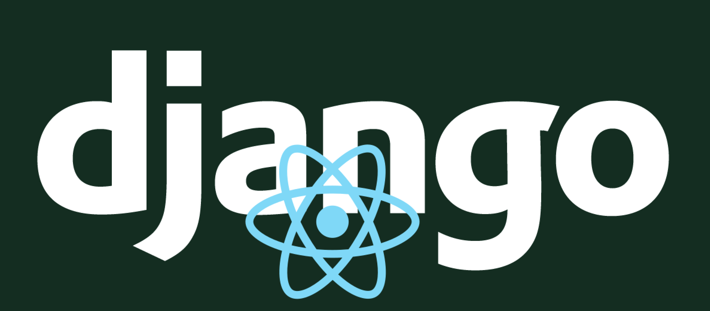

# (◉ ͜ʖ◉))ﾉ彡 REA-NGO 2Do-List ✧٩(•́⌄•́๑)
>   Project mixin Django & React

### Description 
> Start 16-10-2020

###  Index

-   [Description](#description)
-   [Release Notes](#release-notes)
-   [Collaboration](#collaboration)
-   [Timeline](#timeline)

---

### Description
Create a 2do-list using powerfull back-end of Django 
and the great front library React. 

---

### Release Notes

####    v-0.1 
>   Project initialisation

*   Init README.md
*   Init GitFlow
*   Create django project
*   Configure database link
*   Create "Todo" app 

---

### **BeCode** Intensive Bootcamp     
This project took place in my learning path in BeCode (see below) to full stack web developer.
In seven months you have a wonderful luck to become a great web developer. Inclusion and share spirit is your daily feeling !  
Give maximum to get maximum :rocket:

### COLLABORATION
Hello, I'm [Nicolas](https://www.linkedin.com/in/nicolas-denoel/), welcome to my all new life as developer.
After 15 years as manager and sales director it's time for me to make my dreams come true and to become a developer.
An autonomous learner, problem solver and committed team member, I'm ready for challenges !
So feel strongly to give me any recommendations about my work, advice for future projects, and all comments you want.  
If you are looking to hire a strong hybrid and atypical profile in your team do not hesitate to contact me to check if we can share a project together !  
Thanks by advance for that :heart:  

### TIMELINE
[:calendar: Discover the great timeline of my adventure to become a developer. Want to write your company's name on it ? Let's meet !](https://timelines.gitkraken.com/timeline/2e12cc334eb0406b84bf7a6339e666c4?range=2020-05-26_2020-06-27)  

