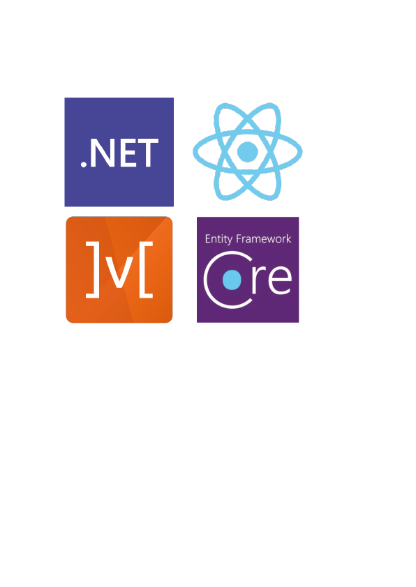

<!-- PROJECT LOGO -->
 

  

                                                           
<h2 align="center">Soci'Act</h2>

  Social Network and Activities
   
   
  <a href="#description">Description</a>
  ·
  <a href="#technos">Technos</a>
  ·
  <a href="#packages">Packages</a>
  ·
  <a href="#releases">Releases</a>
  ·
  <a href="#contacts">Contacts</a>

---

## Description

This project aims to develop a social networking and activity management application.
The user will be able to create a personalised profile, create or register for events.
He can follow other users and chat with them in real time.

Implemented :  
User can view a list of created activities that are stored in the database.
User can view details, create, edit and delete each activity. 
User can customize activity picture according to some general themes

---

## Technos

*   .NET 5.0
*   REACT 17
*   ENTITY 6
*   MOBX 6

---

## Packages

*   ### Backend
    +   AutoMapper.Extensions.Microsoft.DependencyInjection
    +   MediatR.Extensions.Microsoft.DependencyInjection
    +   Microsoft.EntityFrameworkCore.Design
    +   Microsoft.EntityFrameworkCore.Sqlite
    +   Swashbuckle.AspNetCore (Swagger)
*   ### Frontend
    +   axios
    +   mobx
    +   mobx-react-lite
    +   react
    +   react-router-dom
    +   semantic-ui
    +   semantic-ui-css
    +   semantic-ui-react
    +   typeScript
    +   uuid

---

## Releases

-   ### [v0.0.6](#v006)
-   ### [v0.0.5](#v005)
-   ### [v0.0.4](#v004)
-   ### [v0.0.3](#v003)
-   ### [v0.0.2](#v002)
-   ### [v0.0.1](#v001)

    ### v0.0.6
    >   Routing

    *   Frontend
        +   React-router-dom
            *   Add navbar links
            *   Add button links
        +   MobX
            *   Adapt activityStore
        +   Homepage
            *   Isolate HomePage
            *   Add link to activities
        +   Refactoring
            *   Switch buttons behaviours
            *   Get rid of flickering 
            *   Clean console warnings

    ### v0.0.5
    >   Axios - MobX
    
    *   Frontend
        +   Axios
            *   Configure Axios and create agent
            *   Connect all requests to SociApi
            *   Use generic type 
            *   Create an Axios interceptor (fake delay)
        +   MobX - State manager
            *   Create store.ts
            *   Create activityStore.ts
            *   Add all actions to activityStore.ts
                +   CRUD activities operations
                +   Loading state
                +   Edit mode state
            *   Make components observables with observers
        +   Refactoring
            *   Move logic from components to stores
            *   Add async / await syntax
            *   Add map syntax
            *   Optimize destructuring
            *   Optimize imports
            *   Clean all console warnings

    ###    v0.0.4
    >   Frontend connection
    
    *   Frontend
        +   TypeScript
            *   Implement interfaces
            *   Destructure React props
        +   CRUD (front only)
            *   Add activity
            *   Edit activity
            *   Delete activity
            *   View activity(ies)
        +   React
            *   Basic forms
            *   Semantic-ui-react components
    
    ###    v0.0.3
    >   CQRS & Mediator pattern
    
    *   Backend
        +   SociApi
            *   Implement MediatR in BaseApiController
            *   Migrate services into ApplicationServiceExtensions
            *   Adds routes to ActivitiesController
                +   CreateActivity
                +   DeleteActivity
                +   EditActivity
        +   SociApplication
            *   Add Create (activity)
            *   Add Delete (activity)
            *   Add Edit (activity)
            *   Implement AutoMapper

    ####    v0.0.2
    >   Skeleton
        
    *   Frontend
        +   Init React frontend
        +   Add TypeScript
        +   First activities fetch with Axios
        +   Start basic design with Semantic-UI
    *   Backend
        +   SociApi
            *   Create API controller template
            *   Create Activities controller
            *   Add routes to ActivitiesController
                +   GetActivity
                +   GetActivities
            *   Remove example controller
        +   SociApplication
            *   Add Detail (of activity)
            *   Add List (of activities)
        +   SociOmain
            *   Create Activity class (model)
        +   SociStence
            *   Create DataContext
            *   Add Activities (Activity DbSet)
            *   First migration (Entity to Sqlite)
            *   Add seed for activities
    
    ###    v0.0.1
    >   Init Project
    
    *   Create API **SociApi**
        +   Backend in ASP.Net
    *   Create application *SociApplication*
        +   Frontend in React
    *   Create domain *SociOmain*
        +   Project Core
    *   Create persistence *SociStence*
        +   Database Link using Entity
    *   Init Readme.md

---

### Contacts

  
  
 
 
<a href="https://timelines.gitkraken.com/timeline/2e12cc334eb0406b84bf7a6339e666c4?range=2020-05-26_2021-08-02">:calendar: My Developer Timeline</a>
