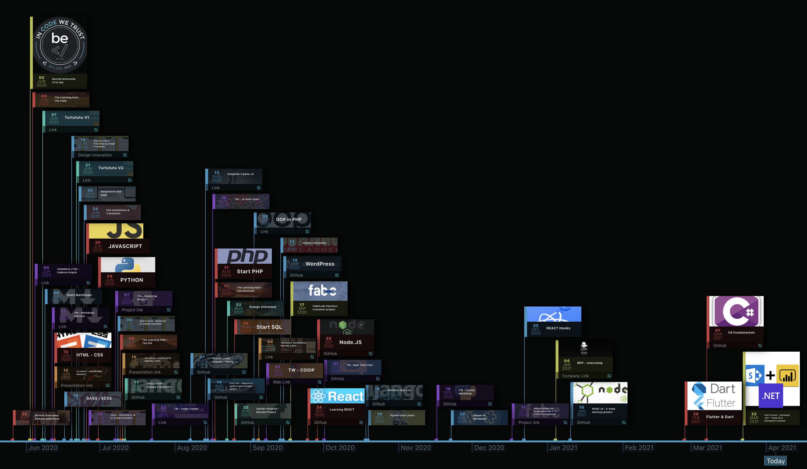

<!-- PROJECT LOGO -->
 

  

<h3 align="center">.NET-SHREPOINT-BI BOOTCAMP</h3>

    A full-time 6monts bootcamp to learn .Net 5.0 / Entity frameworks.
     
    Datawarehouse will be built with SSIS, SSRS and SSAS
    See <a href="#bootcamp-program">summary</a> for more information

     
     
    <a href="#bootcamp-program">Bootcamp summary</a>
    ·
    <a href="#database">Database</a>
    ·
    <a href="#c-sharp">C Sharp</a>
    .
    <a href="#asp-dotnet">ASP dotNET</a>
    .
    <a href="#business-intelligence">Business Intelligence</a>
    .
    <a href="#timeline">Timeline</a>
    .

---

##  Bootcamp Program

### Database Module
>   Create, manipulate database

-   Data manipulation
-   Relational modeling and denormalization 
-   Development in declarative SQL
-   Procedural SQL development

### Development module
>   Develop applications using ASP.Net 

-   .NET development
-   C# development
-   Database connectivity with ADO and LINQ
-   Entity Framework
-   ASP development in MVC
-   Web API and consumption in SharePoint

### Business Intelligence Module
>   Collect, analyse data and create reports

-   Business Intelligence
-   Foundations of BI
-   Dimensional modeling
-   Datawarehousing with SSIS, SSRS and SSAS
-   Power BI
-   Qlick Sense and Qlick View

---

##  Database

1.  [Database](https://github.com/nicode-io/ASP.NET_BI_Bootcamp/tree/main/01-Database)
    *   [Theory](https://github.com/nicode-io/ASP.NET_BI_Bootcamp/tree/main/01-Database/01-01_Theory)
        +   [Database Introduction](https://github.com/nicode-io/ASP.NET_BI_Bootcamp/blob/main/01-Database/01-01_Theory/01-01-01_Database%20introduction.pdf)
        +   [Database Introduction - Mindmap](https://github.com/nicode-io/ASP.NET_BI_Bootcamp/blob/main/01-Database/01-01_Theory/01-01-02_Database%20introduction%20-%20Mindmap.pdf)
        +   [Reading Cardinalities](https://github.com/nicode-io/ASP.NET_BI_Bootcamp/blob/main/01-Database/01-01_Theory/01-01-03_Reading%20cardinalities.pdf)
        +   [Declarative SQL - Complete Theory](https://github.com/nicode-io/ASP.NET_BI_Bootcamp/blob/main/01-Database/01-01_Theory/01-01-04_Declarative%20SQL%20-%20Complete%20theory.pdf)
        +   [Declarative SQL - Mindmap](https://github.com/nicode-io/ASP.NET_BI_Bootcamp/blob/main/01-Database/01-01_Theory/01-01-05_Declarative%20SQL%20-%20Mindmap.pdf)
        +   [Execution Order of SELECT](https://github.com/nicode-io/ASP.NET_BI_Bootcamp/blob/main/01-Database/01-01_Theory/01-01-06_Execution%20order%20of%20a%20SELECT.pdf)
        +   [Data Manipulation Language (DML)](https://github.com/nicode-io/ASP.NET_BI_Bootcamp/blob/main/01-Database/01-01_Theory/01-01-07_Data%20Manipulation%20Language%20(DML).pdf)
        +   [Procedural SQL MindMap](https://github.com/nicode-io/ASP.NET_BI_Bootcamp/blob/main/01-Database/01-01_Theory/01-01-08_Procedural_SQL_Mindmap.png)
        +   [Procedural SQL Theory](https://github.com/nicode-io/ASP.NET_BI_Bootcamp/blob/main/01-Database/01-01_Theory/01-01-09_Procedural_T-SQL_Therory.pdf)
        +   [Procedural SQL Mindmap Recap](https://github.com/nicode-io/ASP.NET_BI_Bootcamp/blob/main/01-Database/01-01_Theory/01-01-10_Procedural_SQL_Mindmap_Recap.png)
        +   [Procedural SQL Mindmap Functions Procedures](https://github.com/nicode-io/ASP.NET_BI_Bootcamp/blob/main/01-Database/01-01_Theory/01-01-11_Procedural_SQL_Mindmap_Functions_Procedures.png)
        +   [Procedural SQL CheatSheet](https://github.com/nicode-io/ASP.NET_BI_Bootcamp/blob/main/01-Database/01-01_Theory/01-01-12_Declarative_SQL_CheatSheet.pdf)
        +   [Procedural SQL Full Mindmap](https://github.com/nicode-io/ASP.NET_BI_Bootcamp/blob/main/01-Database/01-01_Theory/01-01-13_SQL_Full_Mindmap.png)
        +   [Procedural SQL Full Mindmap Functions Procedures](https://github.com/nicode-io/ASP.NET_BI_Bootcamp/blob/main/01-Database/01-01_Theory/01-01-14_Procedure_Function_Mindmap.png)
    *   [Exercises](https://github.com/nicode-io/ASP.NET_BI_Bootcamp/tree/main/01-Database/01-02_Exercices)
        +   [Exercice 1 - Library](https://github.com/nicode-io/ASP.NET_BI_Bootcamp/blob/main/01-Database/01-02_Exercises/01-02-01_Library.pdf)
        +   [Exercice 2 - Cooking Recipe](https://github.com/nicode-io/ASP.NET_BI_Bootcamp/blob/main/01-Database/01-02_Exercises/01-02-02_Cooking_recipe.pdf)
        +   [Exercice 3 - Book Editor](https://github.com/nicode-io/ASP.NET_BI_Bootcamp/blob/main/01-Database/01-02_Exercises/01-02-03_Booking_editor.pdf)
        +   [Exercice 4 - University](https://github.com/nicode-io/ASP.NET_BI_Bootcamp/blob/main/01-Database/01-02_Exercises/01-02-04_University.pdf)
        +   [Exercice 6 - Airport](https://github.com/nicode-io/ASP.NET_BI_Bootcamp/blob/main/01-Database/01-02_Exercises/01-02-05_Airport.pdf)
        +   [Module 1 - Statement](https://github.com/nicode-io/ASP.NET_BI_Bootcamp/blob/main/01-Database/01-02_Exercises/01-02-06_Module_1.pdf)
        +   [Module 2 - Database Creation Query](https://github.com/nicode-io/ASP.NET_BI_Bootcamp/blob/main/01-Database/01-02_Exercises/01-02-07_Creation%20DBSlide%20-%20Database.sql)
        +   [Module 2 - Database Creation Content Query](https://github.com/nicode-io/ASP.NET_BI_Bootcamp/blob/main/01-Database/01-02_Exercises/01-02-08_Creation%20DBSlide%20-%20Database_Content.sql)
        +   [Module 2 - Exercises' Statement](https://github.com/nicode-io/ASP.NET_BI_Bootcamp/blob/main/01-Database/01-02_Exercises/01-02-09_Module_2_Statement.pdf)
        +   [Module 2 - Exercises' Solutions](https://github.com/nicode-io/ASP.NET_BI_Bootcamp/blob/main/01-Database/01-02_Exercises/01-02-10_Module_2_Solutions.sql)
        +   [Module 3 - Exercises' Statement](https://github.com/nicode-io/ASP.NET_BI_Bootcamp/blob/main/01-Database/01-02_Exercises/01-02-11_Module_3_Statement.pdf)
        +   [Module 3 - Exercises' Solutions](https://github.com/nicode-io/ASP.NET_BI_Bootcamp/blob/main/01-Database/01-02_Exercises/01-02-12_Module_3_Solutions.sql)
        +   [Procedural Module 1 - Exercises' Statement](https://github.com/nicode-io/ASP.NET_BI_Bootcamp/blob/main/01-Database/01-02_Exercises/01-02-13_Procadural_Module_1_Statement.pdf)
        +   [Procedural Module 1 - Exercises' Solutions](https://github.com/nicode-io/ASP.NET_BI_Bootcamp/blob/main/01-Database/01-02_Exercises/01-02-14_Procedural_Module_1_Solutions.sql)
        +   [Procedural Module 2 - Exercises' Statement](https://github.com/nicode-io/ASP.NET_BI_Bootcamp/blob/main/01-Database/01-02_Exercises/01-02-15_Procedural_Module_2_Statement.pdf)
        +   [Procedural Module 2 - Exercises' Solutions](https://github.com/nicode-io/ASP.NET_BI_Bootcamp/blob/main/01-Database/01-02_Exercises/01-02-16_Procedural_Modue_2_Solutions.sql)
        +   [Procedural Module 3 - Exercises' Statement](https://github.com/nicode-io/ASP.NET_BI_Bootcamp/blob/main/01-Database/01-02_Exercises/01-02-17_Procedural_Module3_Statement.pdf)
        +   [Procedural Module 3 - Exercises' Solutions](https://github.com/nicode-io/ASP.NET_BI_Bootcamp/blob/main/01-Database/01-02_Exercises/01-02-18_Procedural_Module_3_Solutions.sql)
        +   [Procedural Module 4 - Exercises' Statement](https://github.com/nicode-io/ASP.NET_BI_Bootcamp/blob/main/01-Database/01-02_Exercises/01-02-19_Procedural_Module_4_Statement.pdf)
        +   [Procedural Module 4 - Exercises' Solutions](https://github.com/nicode-io/ASP.NET_BI_Bootcamp/blob/main/01-Database/01-02_Exercises/01-02-20_Procedural_Module_4_Solutions.sql)
        +   [Procedural Module 5 - Exercises' Statement](https://github.com/nicode-io/ASP.NET_BI_Bootcamp/blob/main/01-Database/01-02_Exercises/01-02-21_Procedural_Module_5_Statement.pdf)
        +   [Procedural Module 5 - Exercises' Solutions - Part 1](https://github.com/nicode-io/ASP.NET_BI_Bootcamp/blob/main/01-Database/01-02_Exercises/01-02-22_Procedural_Module_5_Solutions_part_one.sql)
    
---

##  C Sharp

2.  [02. C#](https://github.com/nicode-io/ASP.NET_BI_Bootcamp/tree/main/02-C_Sharp)
    *   [01. Theory](https://github.com/nicode-io/ASP.NET_BI_Bootcamp/tree/main/02-C_Sharp/02-01_Theory)
        +   [01. Fundamentals](https://github.com/nicode-io/ASP.NET_BI_Bootcamp/blob/main/02-C_Sharp/02-01_Theory/02-01-01_C%23_Fundamentals.pdf)
        +   [02. C# Basics Cheat SHeet](https://github.com/nicode-io/ASP.NET_BI_Bootcamp/blob/main/02-C_Sharp/02-01_Theory/02-01-02_CSharpCheatSheet_V2.2-1.pdf)
        +   [03. Intro OOP - UML Overview](https://github.com/nicode-io/ASP.NET_BI_Bootcamp/blob/main/02-C_Sharp/02-01_Theory/02-01-03_Intro_OOP-UML_overview.pdf)
        +   [04. Into OOP - Notations](https://github.com/nicode-io/ASP.NET_BI_Bootcamp/blob/main/02-C_Sharp/02-01_Theory/02-01-04_Intro_OOP-Notations.pdf)
        +   [05. Intro OOP - OVerview Concepts](https://github.com/nicode-io/ASP.NET_BI_Bootcamp/blob/main/02-C_Sharp/02-01_Theory/02-01-05_Intro_OOP-Overview_concepts.pdf)
        +   [06. Intro OOP - Concepts](https://github.com/nicode-io/ASP.NET_BI_Bootcamp/blob/main/02-C_Sharp/02-01_Theory/02-01-06_Intro_OOP-Concepts.pdf)
        +   [07. Intro OOP - Encapsulation](https://github.com/nicode-io/ASP.NET_BI_Bootcamp/blob/main/02-C_Sharp/02-01_Theory/02-01-07_Intro_OOP-Encapsulation.pdf)
        +   [08. Intro OOP - Inheritance](https://github.com/nicode-io/ASP.NET_BI_Bootcamp/blob/main/02-C_Sharp/02-01_Theory/02-01-08_Intro_OOP-Inheritance.pdf)
        +   [09. Intro OOP - Abstraction](https://github.com/nicode-io/ASP.NET_BI_Bootcamp/blob/main/02-C_Sharp/02-01_Theory/02-01-09_Intro_OOP-Abstraction.pdf)
        +   [10. Intro OOP - Interface](https://github.com/nicode-io/ASP.NET_BI_Bootcamp/blob/main/02-C_Sharp/02-01_Theory/02-01-10_Intro_OOP-Interface.pdf)
        +   [11. Intro OOP - Design Pattern](https://github.com/nicode-io/ASP.NET_BI_Bootcamp/blob/main/02-C_Sharp/02-01_Theory/02-01-11_Intro_OOP-Design_pattern.pdf)
        +   [12. Polymporphism Schema](https://github.com/nicode-io/ASP.NET_BI_Bootcamp/blob/main/02-C_Sharp/02-01_Theory/02-01-12-Polymorphism_Schema.png)
    *   [02. Code](https://github.com/nicode-io/ASP.NET_BI_Bootcamp/tree/main/02-C_Sharp/02-02_Code)
        +   [01. Basic Syntax](https://github.com/nicode-io/ASP.NET_BI_Bootcamp/tree/main/02-C_Sharp/02-02_Code/02-02-01_Basic_Syntax_Algo/02-02-01_Basic_Syntax_Algo)
        +   [02. Structures](https://github.com/nicode-io/ASP.NET_BI_Bootcamp/tree/main/02-C_Sharp/02-02_Code/02-02-02_Structures/02-02-02_Structures)
        +   [03. Enums](https://github.com/nicode-io/ASP.NET_BI_Bootcamp/tree/main/02-C_Sharp/02-02_Code/02-02-03_Enums)
        +   [04. OOP Part One](https://github.com/nicode-io/ASP.NET_BI_Bootcamp/tree/main/02-C_Sharp/02-02_Code/02-02-04_Oop_01)
        +   [05. OOP Bank exercise](https://github.com/nicode-io/ASP.NET_BI_Bootcamp/tree/main/02-C_Sharp/02-02_Code/02-02-05_Oop_Bank_Classes_Interfaces)
	*   [03. Visual & Graphics](https://github.com/nicode-io/ASP.NET_BI_Bootcamp/tree/main/02-C_Sharp/02-03_Visuals_Graphics)
        +   [01. Polymorphism / Inheritance](https://github.com/nicode-io/ASP.NET_BI_Bootcamp/blob/main/02-C_Sharp/02-03_Visuals_Graphics/02-03-01_Polymorphism-Inheritance.png)
        +   [02. 3-Tier Architecture](https://github.com/nicode-io/ASP.NET_BI_Bootcamp/blob/main/02-C_Sharp/02-03_Visuals_Graphics/02-03-02_3-Tier_Architecture.png)
        +   [03. Businness Intelligence: Big PIcture](https://github.com/nicode-io/ASP.NET_BI_Bootcamp/blob/main/02-C_Sharp/02-03_Visuals_Graphics/02-03-03_BI_Big_Picture.png)
        +   [04. Software development jobs](https://github.com/nicode-io/ASP.NET_BI_Bootcamp/blob/main/02-C_Sharp/02-03_Visuals_Graphics/02-03-04_Software_Roles.png)

---

##  ASP dotNET

3.  [03. ASP dotNet](https://github.com/nicode-io/ASP.NET_BI_Bootcamp/tree/main/03-ASP_dotNet)
    *   [01. ADO LinQ](https://github.com/nicode-io/ASP.NET_BI_Bootcamp/tree/main/03-ASP_dotNet/01-Ado_LinQ)
        +   [01. Theory](https://github.com/nicode-io/ASP.NET_BI_Bootcamp/tree/main/03-ASP_dotNet/01-Ado_LinQ/01-01-Theory)
            *   [01. Ado.Net](https://github.com/nicode-io/ASP.NET_BI_Bootcamp/blob/main/03-ASP_dotNet/01-Ado_LinQ/01-01-Theory/01-01-01-%20Ado%20.Net.pdf)
            *   [02. LinQ](https://github.com/nicode-io/ASP.NET_BI_Bootcamp/blob/main/03-ASP_dotNet/01-Ado_LinQ/01-01-Theory/01-01-02-Linq.pdf)
            *   [03. LinQ to Objects](https://github.com/nicode-io/ASP.NET_BI_Bootcamp/blob/main/03-ASP_dotNet/01-Ado_LinQ/01-01-Theory/01-01-03-LinqToObjects.pdf)
            *   [04. LinQ Operators](https://github.com/nicode-io/ASP.NET_BI_Bootcamp/blob/main/03-ASP_dotNet/01-Ado_LinQ/01-01-Theory/01-01-04-Linq_Operators.pdf)
        +   [02. Code](https://github.com/nicode-io/ASP.NET_BI_Bootcamp/tree/main/03-ASP_dotNet/01-Ado_LinQ/01-02-Code)
            *   [01. Introduction to ADO: SqlConnection, SqlAdapter, ExecuteReader, ExecuteScalar](https://github.com/nicode-io/ASP.NET_BI_Bootcamp/tree/main/03-ASP_dotNet/01-Ado_LinQ/01-02-Code/01-02-01-Introduction)
            *   [02. Basic Connection Toolbox](https://github.com/nicode-io/ASP.NET_BI_Bootcamp/tree/main/03-ASP_dotNet/01-Ado_LinQ/01-02-Code/01-02-02-Toolbox)
            *   [03. LinQ Exos](01-02-03-Exos)

---

##  Business Intelligence

4.  [04. BI](https://github.com/nicode-io/ASP.NET_BI_Bootcamp/tree/main/04-Business_Intelligence)
    *   [01. Theory](https://github.com/nicode-io/ASP.NET_BI_Bootcamp/tree/main/02-C_Sharp/02-03_Visuals_Graphics)
        +   [01. BI Schema](https://github.com/nicode-io/ASP.NET_BI_Bootcamp/blob/main/04-Business_Intelligence/04-01-Theory/04-01-01-BI_Schema.png)

---

### Timeline
> Current steps and history of my reconversion

[:calendar: Discover the timeline of my adventure to become a developer. Want to write your company's name on it ? Let's meet !](https://timelines.gitkraken.com/timeline/2e12cc334eb0406b84bf7a6339e666c4?range=2020-05-26_2021-08-02)
