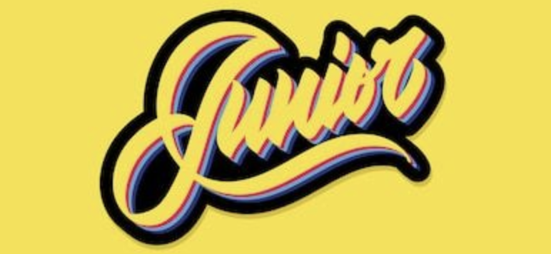

    

<h3 align="center">The Starting Point</h3>

 
 
This repo contains the imprint of a landmark time and will perhaps only be of interest to me, and those who
have gone through this time with me, but it is already so much.
 
 
Thanks to all those who help me every day to achieve my goals in the passion of development.

---

### 1. Fundamentals
> All begin with fundamentals knowledge

### 2. Learning Path
> JS Frameworks, JS, Python : the very start

###  3. Cursus
> Cursus followed on side of my main learning path, includes Node, Docker, Python, ....

###  4. Practising during BeCode
> All learning side-project executed during BeCode bootcamp

### 5. Bootcamps
> Content of my two main bootcamps:  BeCode Web Dev & Technofutur .Net/BI

### 6. Guides
> Guide to VPS and to Badgr (LinkedIn)
> 
###  7. Collaborations @ BeCode

### 8. Dalgo
> Algorythms & Data structure

### 9. Flut'Art
> Flutter content

### 10. Notifications
> Manage push & local notifications in React Native application

### 11. Python API
> Small API written in Python

### 12. Python Games
> A few games written in Python like for example pacman, snake, simons, tictactoe, tron, ...

### 13. ReactJS
> Real-life project using React examples with an e-shop, a GraphQL API, ...

### 14. TypeScript
> Some applications of TypeScript in different context like React, OOP, ...

### 15. Javascript Weird Parts
> Get a better understanding and go deeper in JavaScript. Prototypes, closures, all is object and many more

### 16. Advanced CSS with SASS
> Practising SASS in three main projects using first classic CSS then FlexBox and finally GRID

### 17. React ATDD
> Discover the test driven development in React context, using mainly JEST, Cypher, react-testing-library. 

--- 

## Timeline

> My developer timeline

Thanks to all those who help me every day to live in the passion of coding. 🚀 🖤💛💖
